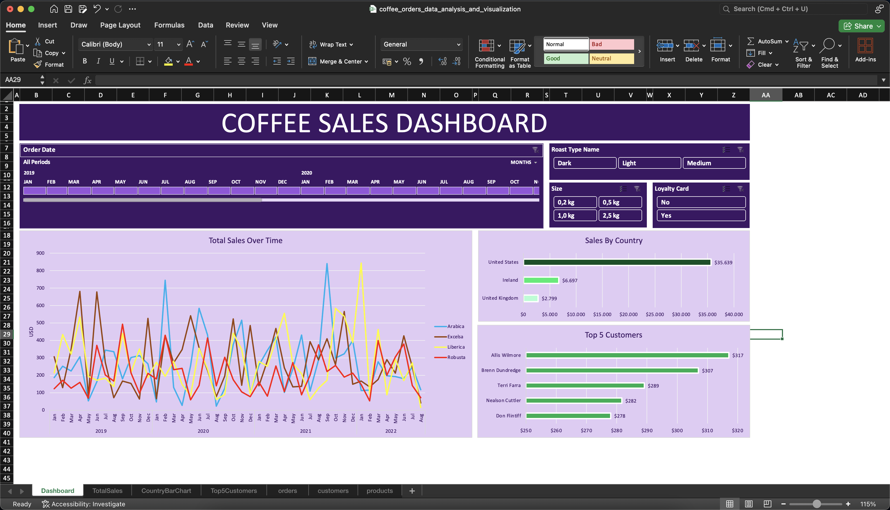
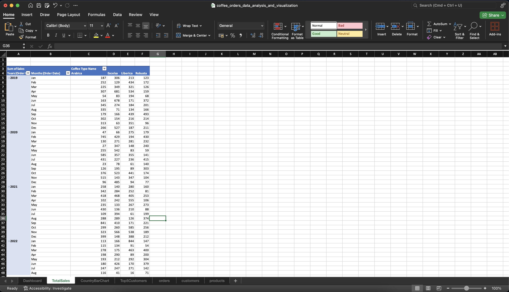
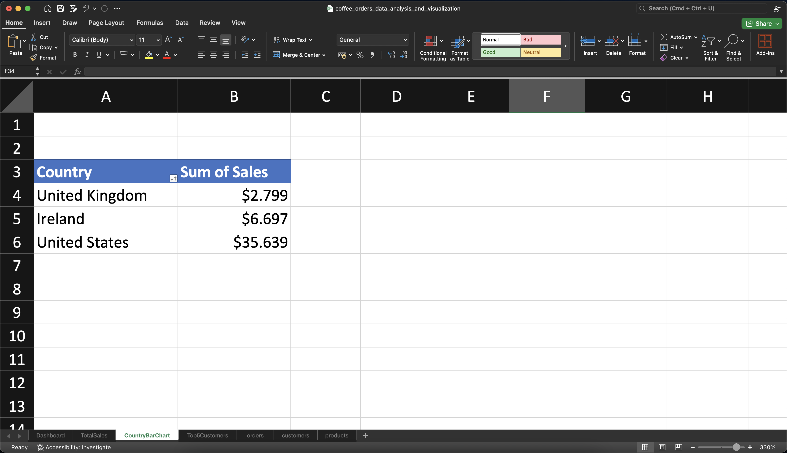
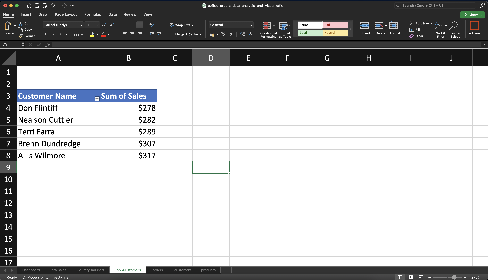
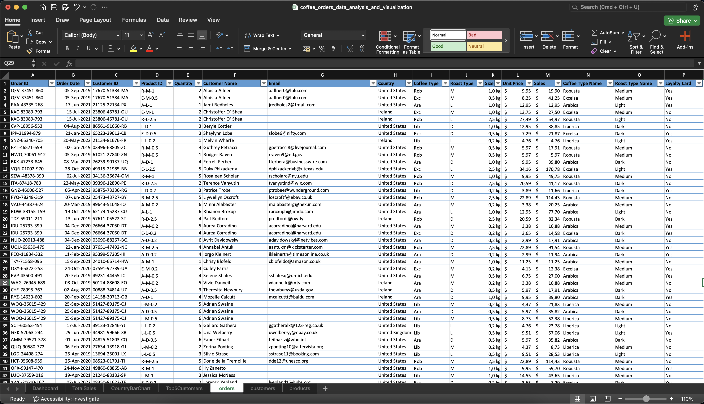
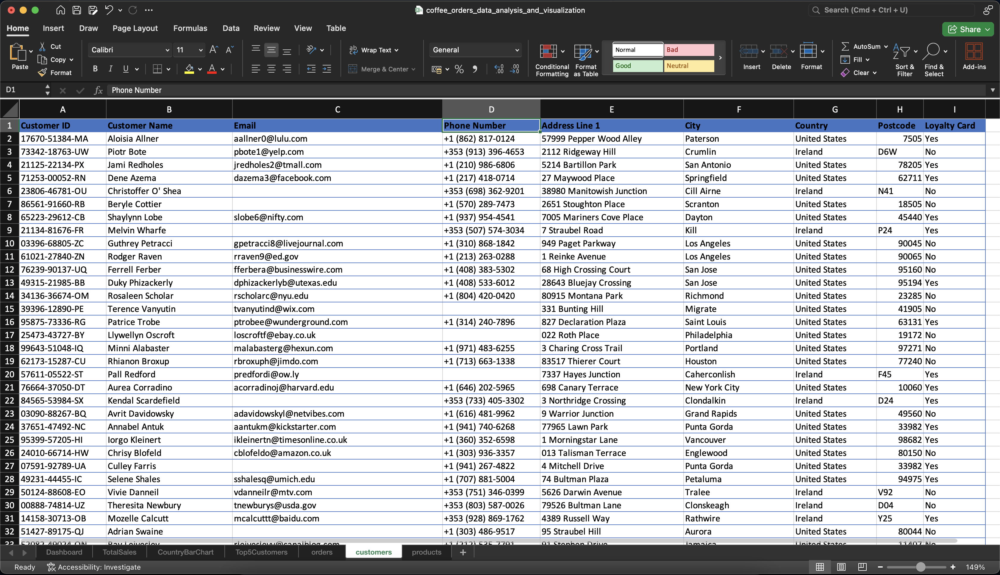
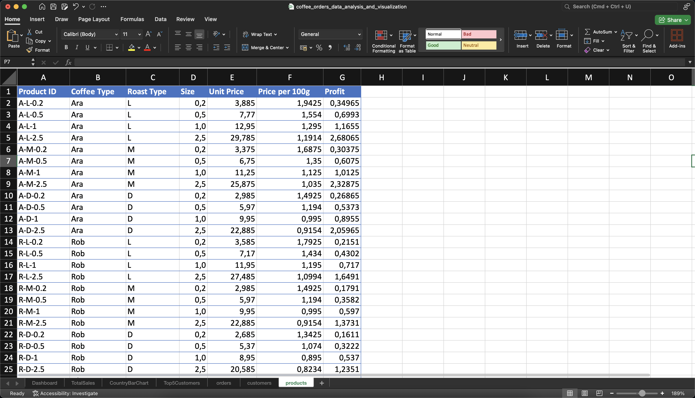

# Coffee Orders Data Analysis and Visualization

## Description
The "Coffee Orders" project is based on a dataset aimed at analyzing and visualizing coffee orders using Microsoft Excel. In this project, insights have been derived about sales, customer behavior, and product preferences by examining detailed information about customer coffee orders. The data consists of three main sheets containing order details, customer information, and product data. After the analysis process, the data has been visualized, and various analyses have been provided.

- **Dashboard:** Overview and main analysis results
- **TotalSales:** Total sales and sales trends
- **CountryBarChart:** Sales visualization by country
- **Top5Customers:** Top 5 customers with the highest sales
- **Orders, customers, products:** Raw data and updated data after analysis

## Screenshots of the project

## Dataset Information

Dataset Information
The project uses a dataset consisting of three main sheets:

### 1. orders (Orders)
This sheet contains detailed information about coffee orders. The columns are as follows:

- orderID: Order ID
- orderDate: Order date
- customerID: Customer ID
- productID: Product ID
- Quantity: Quantity ordered
- Customer Name: Customer name
- Email: Customer email address
- Country: Customer country
- Coffee Type: Coffee type
- Roast Type: Roast type
- Size: Size
- Unit Price: Unit price
- Sales: Sales amount
### 2. customers (Customers)
This sheet contains the personal information of customers. The columns are as follows:

- CustomerID: Customer ID
- CustomerName: Customer name
- Email: Customer email address
- PhoneNumber: Customer phone number
- Address Line 1: Address line 1
- City: City
- Country: Country
- Postcode: Postcode
- Loyalty Card: Loyalty card information
### 3. products (Products)
This sheet contains details about coffee products. The columns are as follows:

- productID: Product ID
- Coffee Type: Coffee type
- Roast Type: Roast type
- Size: Size
- Unit Price: Unit price
- Price per 100g: Price per 100 grams
- Profit: Profit margin

## Methodology and Analysis Process

The project followed these steps using data analysis and visualization techniques:

- **Data Cleaning and Preparation:** In the first step, missing data and inconsistencies were identified and cleaned. Customer and product data were validated and merged.
- **Data Analysis:** Relationships between orders and customer data were explored, and sales and customer preferences were analyzed. Products were analyzed by coffee type and roast type.
- **Visualization:** Data visualization tools were used to create charts, such as sales distribution by country, top-selling products, and customer profiles. These visuals provide valuable insights for decision-making.
- **Total Sales Analysis** The total sales were analyzed to see how sales changed over a specific period.

## Key Findings and Results

Some of the key findings from the project include:

- **Most Popular Coffee Types:** Espresso and Americano are among the most preferred coffee types.
- **Sales Distribution by Country:** The US, Germany, and the UK have the highest sales.
- **Top-Selling Customers:** Customers with loyalty cards tend to place more orders.
- **Profit Margins:** Expensive coffee types, like espresso, have higher profit margins.

## License

This project is licensed under the MIT License - see the LICENSE.md file for details.
